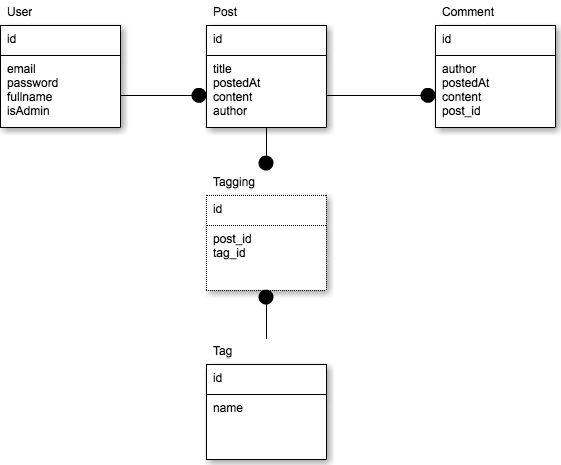

!SLIDE 
# Play framework について #
小野 裕作

!SLIDE

!SLIDE
# Java #

!SLIDE small
* Servelet, JSP を使わない
* XML を使わない
* コンパイル不要
* 設定不要
* Eclipse 不要

!SLIDE
# Ruby on Rails Like #

!SLIDE small
* MVC
* フルスタック
* コマンドで雛形を生成
* ディレクトリ構成
* ソースコードの修正を即座に反映
* テストフレームワークが付属

!SLIDE center
[http://www.playframework.org/](http://www.playframework.org/)

!SLIDE
# Install 

!SLIDE code smaller
<pre>
$ wget http://download.playframework.org/releases/play-1.2.3.zip
$ unzip play-1.2.3.zip
$ export PATH=$PATH:[Playのディレクトリ]
</pre>

!SLIDE commandline
$ export PATH=$PATH:/var/lib/play-1.2.3

!SLIDE
# Start development

!SLIDE commandline
$ play new [プロジェクト名]

!SLIDE commandline
$ play new helloworld

!SLIDE commandline
$ cd helloworld

!SLIDE smaller
- app - ソースコード
- conf - 設定ファイル
- public - 静的ファイル（CSS, JavaScript, Image など)
- test - テスト用コード
- lib - 外部ライブラリ
- modules - Play! 用モジュール
- logs - ログ
- tmp - class ファイルなど
- test-result - テスト結果

!SLIDE
# Run a app

!SLIDE commandline
$ play run

!SLIDE code
[http://localhost:9000](http://localhost:9000)

!SLIDE
# Test

!SLIDE commandline
$ play test

!SLIDE code
[http://localhost:9000/@tests](http://localhost:9000/@tests)

!SLIDE commandline
$ play auto-test

!SLIDE smaller
# Coverage

!SLIDE code smaller
<pre>
$ play install cobertura
$ vim conf/dependencies.yml
# Application dependencies

require:
    - play -> cobertura 2.4
$ play dependencies --forceCopy
</pre>

!SLIDE code smaller
<pre>
$ play auto-test
$ open test-result/code-coverage/index.html
</pre>

!SLIDE
# Other

!SLIDE commandline
$ play help

!SLIDE code smaller
[http://localhost:9000/@documentation](http://localhost:9000/@documentation)

!SLIDE
# Eclipse

!SLIDE code smaller
<pre>
$ play eclipsify
$ cp $PLAY_INSTALLED_DIR/support/eclipse/org.playframework.playclipse_0.7.0.jar \
  $ECLIPSE/dropins/ 
</pre>

!SLIDE
# Scaffold

!SLIDE smaller
# Rails との違い
- 標準機能ではない（モジュール）
- Model は手動で作成
  - Model を基に Controller, View を生成
- login 処理を生成

!SLIDE code smaller
<pre>
$ play install scaffold
</pre>

!SLIDE code smaller
<pre>
$ vim conf/dependencies.yml
# Application dependencies

require:
    - play -> scaffold 0.1
    - play -> secure
</pre>

!SLIDE code smaller
<pre>
$ play dependencies --forceCopy
</pre>

!SLIDE smaller
# --forceCopy の有無
- 有: play のインストールディレクトリ以下に配置
- 無: プロジェクト以下に配置

!SLIDE code smaller
<pre>
$ vim conf/application.conf
$ db=mem
</pre>

!SLIDE smaller
# Model を用意する
## チュートリアルの Model
- User.java
- Post.java
- Comment.java
- Tag.java

!SLIDE center

!SLIDE commandline
$ play scaffold:gen --with-layout --with-login --overwrite

!SLIDE commandline
$ play scaffold:gen --with-layout --with-login --overwrite

!SLIDE code smaller
[http://play-scaffold.herokuapp.com/](http://vivid-mountain-3381.herokuapp.com/)

!SLIDE
# Deploy apps to heroku

!SLIDE code smaller
<pre>
$ vim Procfile
web: play run --http.port=$PORT $PLAY_OPTS
</pre>

!SLIDE code smaller
<pre>
$ vim .gitignore
/lib
/tmp
/modules
/test-result
/logs
/eclipse
</pre>

!SLIDE code smaller
<pre>
$ git init
$ git add .
$ git commit -m 'first commit'
</pre>

!SLIDE commandline
$ heroku create --stack cedar

!SLIDE commandline
$ git push heroku master

!SLIDE smaller
- DB: PostgreSQL
- conf/application.conf を変更
- User クラスはテーブル名を変えておく

!SLIDE smaller
# まとめ
- Java らしくない Java Web Framework
- RoR Like で高速な開発
- heroku 対応で簡単なデプロイ

!SLIDE 

!SLIDE full-page
# Play Scala
[http://playscala.appspot.com](http://playscala.appspot.com)

!SLIDE code
$ play install scala
$ play new helloscala --with scala
